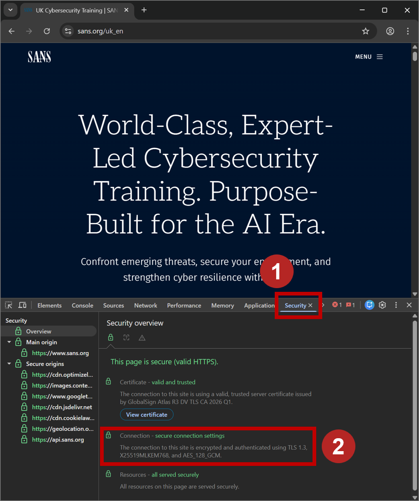
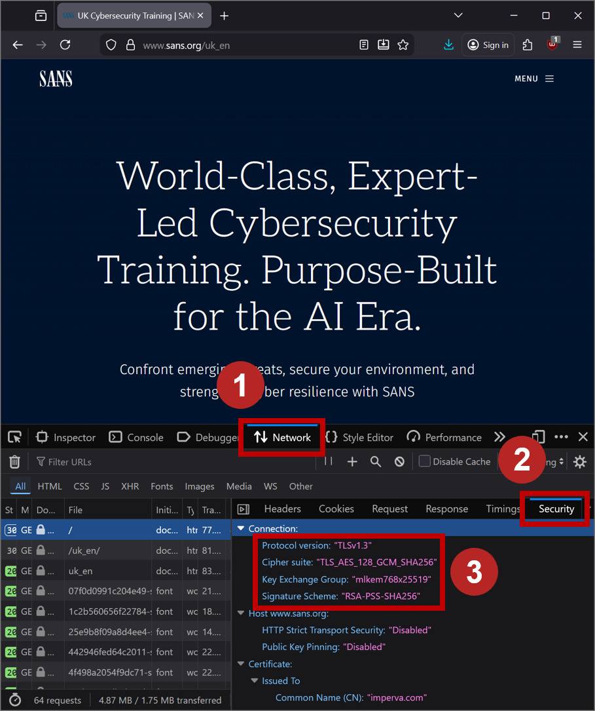
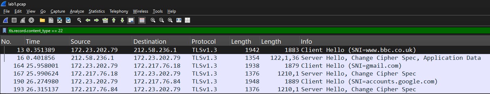

# PQC Lab #1

## Goal
Explore the current state of quantum-resistant cryptography on the public internet.

## Objectives
* Witness quantum-resistant cryptography used in TLS key exchange by modern browsers and services.
* Identity the use of quantum-resistant cryptography through browser dev tools and packet captures.
* Identity where quantum-resistant crypto is not yet in common use.

## Getting Started
To complete this lab you'll need:
* A modern web browser (Chrome, Firefox or Edge)
* A modern version (v4.6.x and above) of Wireshark: download from https://www.wireshark.org/download.html
* The resources for this lab, downloaded to your laptop: [lab1.pcap](./lab1.pcap) 

## Part 1 - Investigate the use of quantum-resistant cryptography between your browser and your favourite websites - how can you tell what crypto is in use and if it is quantum-resistant?

**1\. Open a modern version of Chrome, Firefox or Edge, and press the F12 keyboard button to open up 'Dev Tools'.**
You should see a new window appear, or panel docked to the bottom or side of your current browser window.

**2\. Navigate to any website.**

**3\. Access the cryptographic configuration used by your browser to access the website.** The steps are slightly different depending on which browser you use:

*On Chrome/Edge:* Go to the 'Security' tab in Dev tools, and select 'Overview. You can see the cryptographic configuration under the "Connection" details.

*On Firefox:* Go to the 'Network' tab in Dev Tools, and select any of the network connections made to the website which have the padlock symbol next to them. Then go to the Security sub-tab to see the cryptographic configuration under the "Connection" details. 

**4\. Examine the cryptographic configuration used by your browser to access the website.**

Examine:

* The Key Exchange method. This is the means by which a symmetric key is agreed between the server and client at the start of the session.

* The Symmetric cipher suite. This is the cryptographic scheme used to encrypt the actual payload data. 

* The certificate of the server. This is the public-key digital signature that the server presents to the client, so the client can verify they are communicating with a trusted server (i.e., no machine-in-the-middle interception). (Note: for Chrome/Edge, you'll need to click the 'View Certificate' button, go to 'Details', then scroll down to 'Subject Public Key Algorithm' to find this value).

The following table lists a few of the common traditional and quantum-resistant algorithms you may see:

| Stage | Traditional | Quantum-Resistant |
|----|----|----|
| Key exchange | ECDHE (e.g., P256, X25519) | ML-KEM (usually hybrid, shown as mlkem768x25519) |
| Symmetric cipher suite | AES | AES |
| Server certificate | RSA-2048, ECDSA | ML-DSA |

**5\. Try navigating to a few other websites that you commonly use and get a feeling for which are using quantum-resistant crypto and which are not.**

## Part 2 - Explore where cryptographic properties are transferred within TLS.

**1\. Open Wireshark. Be sure to use a modern version (e.g. 4.6.x and above).**

**2\. Open the [lab1.pcap](lab1.pcap) PCAP provided.** It contains two web requests, including the DNS lookup:

* The first connection was to www.bbc.co.uk. This resulted in a couple of DNS lookups (packets 1 to 9) then a single HTTPS connection (packets 10 to 152).

* The second connection was to www.gmail.com. This also resulted in some DNS traffic (packets 153 to 162) and two HTTPS connections (packets 163 to 186, and packets 182 to 245).

Note there's also some web communication via QUIC (HTTPS over UDP) across packets 211 to 442 - we'll ignore this for now.

**3\. Identify the ClientHello and ServerHello messages.** An easy way to do this is to apply the following Wireshark filter in the filter bar at the top of the screen, and hit enter:

`tls.record.content_type == 22`

You should see six packets. The first two rows are associated with the first HTTPS connection; the third and fourth rows associated with the second connection; and the fifth and sixth rows associated with the third connection.

**4\. Examine the first ClientHello, associated with that first connection to www.bbc.co.uk.**

Select the first packet with the filter applied (it should be packet #13), and in the decode window expand the packet details, specifically under:

Transport Layer Security  
\> TLS1.3 Record Layer  
\>\> Handshake Protocol: Client Hello  
\>\>\> Extension: Supported Groups  
\>\>\>\> Supported Groups

You should see a list of the 7 key exchange groups that the browser is telling the server it supports. There's a mix of traditional and quantum-resistant algorithms specified here. \[[Screenshot: Client Hello](1_clienthello.png)\]

**5\. Examine the first ServerHello, associated with that first connection to www.bbc.co.uk.**

Select the second packet shown with the filter applied (it should be packet #16), and in the decode window expand the packet details, specifically under:

Transport Layer Security  
\> TLS1.3 Record Layer  
\>\> Handshake Protocol: Server Hello  
\>\>\> Extension: key_share  
\>\>\>\> Key share extension  
\>\>\>\>\> Key share entry: Group

You should see that the server has selected x25519 as the key exchange group for this connection. *This connection is not quantum resistant!* Whilst you're here, note the length of the key exchange data - 32 bytes. \[[Screenshot: Server Hello](1_serverhello.png)\]

**6\. Now repeat steps 4 and 5 for the second connection to www.gmail.com.**

This should be packets 164 and 167. In particular look out for:
* Is there any difference to the key exchange groups that the browser tells the server it supports?
* Is there any difference in the key exchange group that the server selects for this second connection?
  - And if so, is there any difference in the size of the key exchange information?

\[[Screenshot: Client Hello](2_clienthello.png)\]
\[[Screenshot: Server Hello](2_serverhello.png)\]

## Further exploration

Whilst we don't go deeper in this lab, if you have time feel free to explore:
* Can you see where are other cryptographic properties (the symmetric cipher and/or server certificate) are defined/exchanged in the TLS configuration?
* Can you spot any of these properties in the QUIC data flows?
* What properties can you not determine from this packet capture, and why would that be?

Enjoy! :-)
